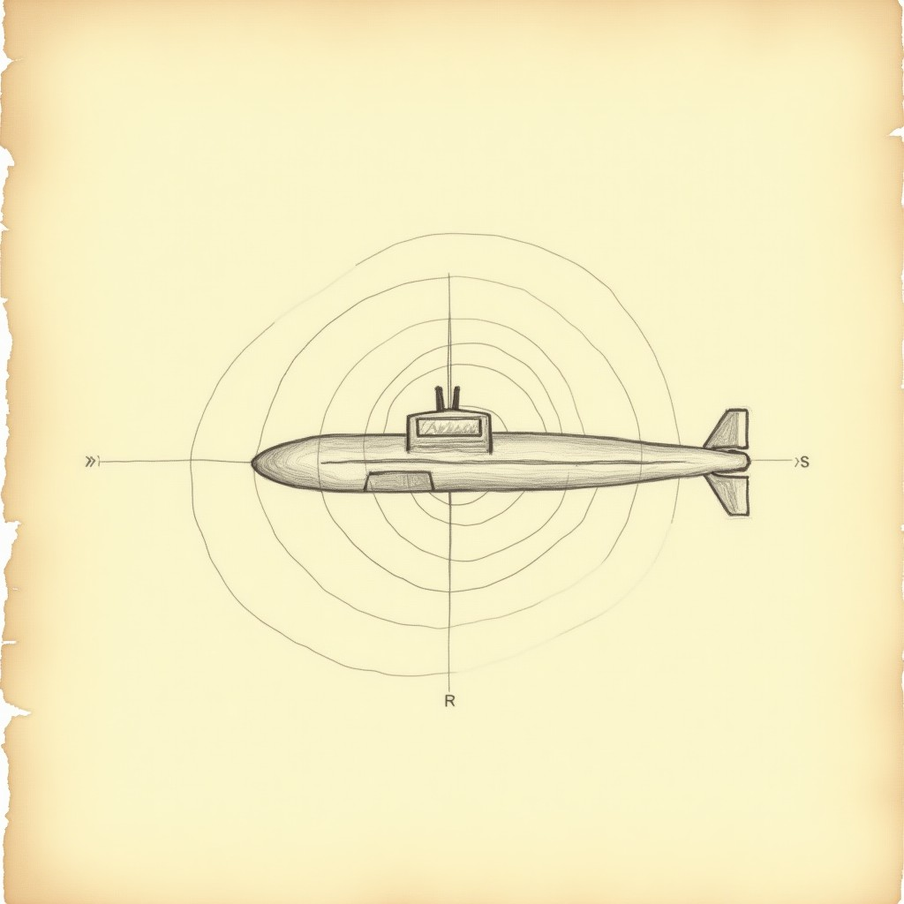

# sonar — Project Diary

*Phase-by-phase log. Entries append, never rewrite. Nothing is done until its wall is green twice.*

---
## 2026-09-22 13:19 — Milestone 1 — the ping sees

The vision core: cooldown-gated sonar, a ring sweeping outward, wrecks revealed as echoes that fade over 3.7 seconds, everything else darkness. The battery caught its own coverage hole and closed it. 17+17 green.

## 2026-09-22 13:22 — Lore recovered

A found document from the world (see LORE.md) and its sketch now live in this repo's diary_images. Oddworld law: the game's instructions are artifacts of its own world.

